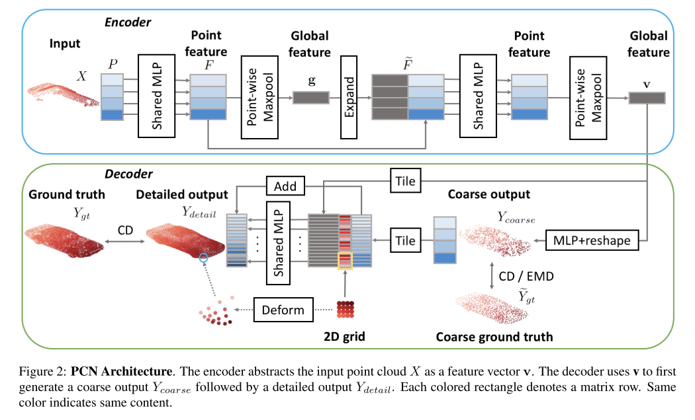

# PCN

早期用神经网络做点云补全的经典之作



## 代码解读

```python
import torch
import torch.nn as nn
from .build import MODELS
from extensions.chamfer_dist import ChamferDistanceL2

@MODELS.register_module()
class PCN(nn.Module):
    def __init__(self, config):
        super().__init__()
        self.number_fine = config.num_pred
        self.encoder_channel = config.encoder_channel
        grid_size = 4 # set default
        self.grid_size = grid_size
        assert self.number_fine % grid_size**2 == 0
        self.number_coarse = self.number_fine // (grid_size ** 2 )
        self.first_conv = nn.Sequential(
            nn.Conv1d(3,128,1),
            nn.BatchNorm1d(128),
            nn.ReLU(inplace=True),
            nn.Conv1d(128,256,1)
        )
        self.second_conv = nn.Sequential(
            nn.Conv1d(512,512,1),
            nn.BatchNorm1d(512),
            nn.ReLU(inplace=True),
            nn.Conv1d(512,self.encoder_channel,1)
        )
        self.mlp = nn.Sequential(
            nn.Linear(self.encoder_channel,1024),
            nn.ReLU(inplace=True),
            nn.Linear(1024,1024),
            nn.ReLU(inplace=True),
            nn.Linear(1024,3*self.number_coarse)
        )
        self.final_conv = nn.Sequential(
            nn.Conv1d(1024+3+2,512,1),
            nn.BatchNorm1d(512),
            nn.ReLU(inplace=True),
            nn.Conv1d(512,512,1),
            nn.BatchNorm1d(512),
            nn.ReLU(inplace=True),
            nn.Conv1d(512,3,1)
        )
        a = torch.linspace(-0.05, 0.05, steps=grid_size, dtype=torch.float).view(1, grid_size).expand(grid_size, grid_size).reshape(1, -1)
        b = torch.linspace(-0.05, 0.05, steps=grid_size, dtype=torch.float).view(grid_size, 1).expand(grid_size, grid_size).reshape(1, -1)
        self.folding_seed = torch.cat([a, b], dim=0).view(1, 2, grid_size ** 2).cuda() # 1 2 S
        self.build_loss_func()

    def build_loss_func(self):
        self.loss_func = ChamferDistanceL2()

    def get_loss(self, ret, gt, epoch=0):
        loss_coarse = self.loss_func(ret[0], gt)
        loss_fine = self.loss_func(ret[1], gt)
        return loss_coarse, loss_fine

    def forward(self, xyz):
        bs , n , _ = xyz.shape
        # encoder
        feature = self.first_conv(xyz.transpose(2,1))  # B 256 n
        feature_global = torch.max(feature,dim=2,keepdim=True)[0]  # B 256 1
        feature = torch.cat([feature_global.expand(-1,-1,n), feature], dim=1)# B 512 n
        feature = self.second_conv(feature) # B 1024 n
        feature_global = torch.max(feature,dim=2,keepdim=False)[0] # B 1024
        # decoder
        coarse = self.mlp(feature_global).reshape(-1,self.number_coarse,3) # B M 3
        point_feat = coarse.unsqueeze(2).expand(-1,-1,self.grid_size**2,-1) # B M S 3
        point_feat = point_feat.reshape(-1,self.number_fine,3).transpose(2,1) # B 3 N

        seed = self.folding_seed.unsqueeze(2).expand(bs,-1,self.number_coarse, -1) # B 2 M S
        seed = seed.reshape(bs,-1,self.number_fine)  # B 2 N

        feature_global = feature_global.unsqueeze(2).expand(-1,-1,self.number_fine) # B 1024 N
        feat = torch.cat([feature_global, seed, point_feat], dim=1) # B C N
    
        fine = self.final_conv(feat) + point_feat   # B 3 N

        return (coarse.contiguous(), fine.transpose(1,2).contiguous())
    
if __name__ == '__main__':
    model = PCN()
    xyz = torch.randn((32,2048,3))
    ret = model(xyz) 
    print(ret)
```
