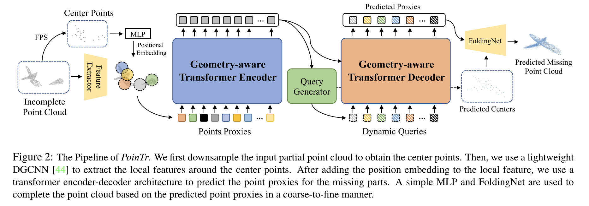

# PoinTr

transformer架构做点云补全的经典之作，代码写的很好，后续很多论文都是基于他的框架去改的



## 代码解读

```python
import torch
from torch import nn

from pointnet2_ops import pointnet2_utils
from extensions.chamfer_dist import ChamferDistanceL1
from .Transformer import PCTransformer
from .build import MODELS


def fps(pc, num):
    fps_idx = pointnet2_utils.furthest_point_sample(pc, num) 
    sub_pc = pointnet2_utils.gather_operation(pc.transpose(1, 2).contiguous(), fps_idx).transpose(1,2).contiguous()
    return sub_pc


class Fold(nn.Module):
    def __init__(self, in_channel , step , hidden_dim = 512):
        super().__init__()

        self.in_channel = in_channel
        self.step = step

        a = torch.linspace(-1., 1., steps=step, dtype=torch.float).view(1, step).expand(step, step).reshape(1, -1)
        b = torch.linspace(-1., 1., steps=step, dtype=torch.float).view(step, 1).expand(step, step).reshape(1, -1)
        self.folding_seed = torch.cat([a, b], dim=0).cuda()

        self.folding1 = nn.Sequential(
            nn.Conv1d(in_channel + 2, hidden_dim, 1),
            nn.BatchNorm1d(hidden_dim),
            nn.ReLU(inplace=True),
            nn.Conv1d(hidden_dim, hidden_dim//2, 1),
            nn.BatchNorm1d(hidden_dim//2),
            nn.ReLU(inplace=True),
            nn.Conv1d(hidden_dim//2, 3, 1),
        )

        self.folding2 = nn.Sequential(
            nn.Conv1d(in_channel + 3, hidden_dim, 1),
            nn.BatchNorm1d(hidden_dim),
            nn.ReLU(inplace=True),
            nn.Conv1d(hidden_dim, hidden_dim//2, 1),
            nn.BatchNorm1d(hidden_dim//2),
            nn.ReLU(inplace=True),
            nn.Conv1d(hidden_dim//2, 3, 1),
        )

    def forward(self, x):
        num_sample = self.step * self.step
        bs = x.size(0)
        features = x.view(bs, self.in_channel, 1).expand(bs, self.in_channel, num_sample)
        seed = self.folding_seed.view(1, 2, num_sample).expand(bs, 2, num_sample).to(x.device)

        x = torch.cat([seed, features], dim=1)
        fd1 = self.folding1(x)
        x = torch.cat([fd1, features], dim=1)
        fd2 = self.folding2(x)

        return fd2

@MODELS.register_module()
class PoinTr(nn.Module):
    def __init__(self, config, **kwargs):
        super().__init__()
        self.trans_dim = config.trans_dim
        self.knn_layer = config.knn_layer
        self.num_pred = config.num_pred
        self.num_query = config.num_query

        self.fold_step = int(pow(self.num_pred//self.num_query, 0.5) + 0.5)
        self.base_model = PCTransformer(in_chans = 3, embed_dim = self.trans_dim, depth = [6, 8], drop_rate = 0., num_query = self.num_query, knn_layer = self.knn_layer)
        
        self.foldingnet = Fold(self.trans_dim, step = self.fold_step, hidden_dim = 256)  # rebuild a cluster point

        self.increase_dim = nn.Sequential(
            nn.Conv1d(self.trans_dim, 1024, 1),
            nn.BatchNorm1d(1024),
            nn.LeakyReLU(negative_slope=0.2),
            nn.Conv1d(1024, 1024, 1)
        )
        self.reduce_map = nn.Linear(self.trans_dim + 1027, self.trans_dim)
        self.build_loss_func()

    def build_loss_func(self):
        self.loss_func = ChamferDistanceL1()

    def get_loss(self, ret, gt, epoch=0):
        loss_coarse = self.loss_func(ret[0], gt)
        loss_fine = self.loss_func(ret[1], gt)
        return loss_coarse, loss_fine

    def forward(self, xyz):
        q, coarse_point_cloud = self.base_model(xyz) # B M C and B M 3
    
        B, M ,C = q.shape

        global_feature = self.increase_dim(q.transpose(1,2)).transpose(1,2) # B M 1024
        global_feature = torch.max(global_feature, dim=1)[0] # B 1024

        rebuild_feature = torch.cat([
            global_feature.unsqueeze(-2).expand(-1, M, -1),
            q,
            coarse_point_cloud], dim=-1)  # B M 1027 + C

        rebuild_feature = self.reduce_map(rebuild_feature.reshape(B*M, -1)) # BM C
        # # NOTE: try to rebuild pc
        # coarse_point_cloud = self.refine_coarse(rebuild_feature).reshape(B, M, 3)

        # NOTE: foldingNet
        relative_xyz = self.foldingnet(rebuild_feature).reshape(B, M, 3, -1)    # B M 3 S
        rebuild_points = (relative_xyz + coarse_point_cloud.unsqueeze(-1)).transpose(2,3).reshape(B, -1, 3)  # B N 3

        # NOTE: fc
        # relative_xyz = self.refine(rebuild_feature)  # BM 3S
        # rebuild_points = (relative_xyz.reshape(B,M,3,-1) + coarse_point_cloud.unsqueeze(-1)).transpose(2,3).reshape(B, -1, 3)

        # cat the input
        inp_sparse = fps(xyz, self.num_query)
        coarse_point_cloud = torch.cat([coarse_point_cloud, inp_sparse], dim=1).contiguous()
        rebuild_points = torch.cat([rebuild_points, xyz],dim=1).contiguous()

        ret = (coarse_point_cloud, rebuild_points)
        return ret

```


